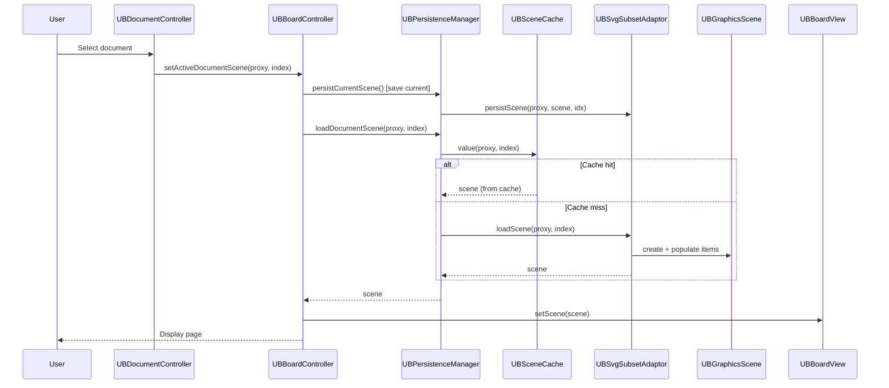
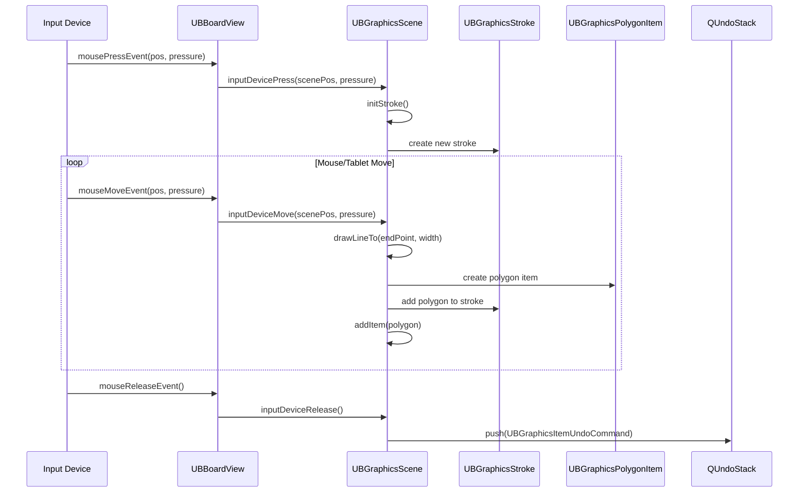
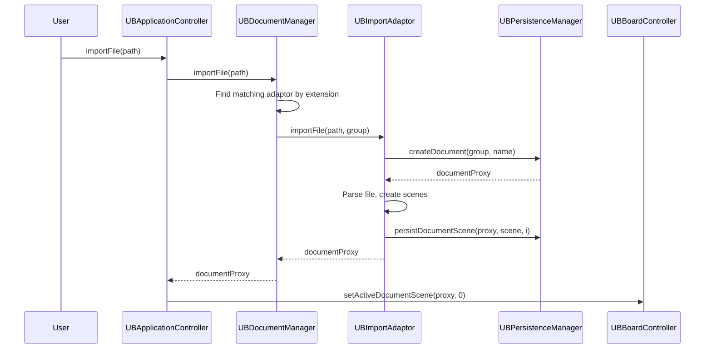

# Behavioral Diagrams

## Sequence Diagram - Document Open



## Sequence Diagram - Freehand Drawing



## Sequence Diagram - Import File



## Activity Diagram - Content Addition

```
[Start] → User drops content on board
    │
    ▼
[Determine content type from URL/MIME]
    │
    ├── Image → Download → addPixmap() → UBGraphicsPixmapItem
    ├── SVG → Download → addSvg() → UBGraphicsSvgItem  
    ├── Video → Download → addVideo() → UBGraphicsVideoItem
    ├── Audio → Download → addAudio() → UBGraphicsAudioItem
    ├── Widget (.wgt) → Extract ZIP → addW3cWidget() → UBGraphicsWidgetItem
    ├── PDF → Import as pages → Multiple UBGraphicsPDFItems
    └── Other → Embed in WebWidget → UBGraphicsProxyWidget
    │
    ▼
[Position item at drop/center point]
    │
    ▼
[Push UBGraphicsItemUndoCommand]
    │
    ▼
[Persist to document directory]
    │
    ▼
[End]
```

## State Machine - Drawing Tool

```
                    ┌──────────┐
     ┌──────────── │   Pen    │ ◄─────────────┐
     │             └────┬─────┘               │
     │                  │ select marker        │ select pen
     │                  ▼                      │
     │             ┌──────────┐               │
     │      ┌───── │  Marker  │ ──────────────┘
     │      │      └──────────┘
     │      │ select eraser
     │      ▼
     │ ┌──────────┐
     │ │  Eraser  │
     │ └──────────┘
     │      │ select selector
     │      ▼
     │ ┌──────────┐
     └►│ Selector │◄── select from any state
       └──────────┘
            │ select hand/zoom/pointer
            ▼
       ┌──────────┐
       │  Other   │ (Hand, ZoomIn, ZoomOut, Pointer, Line, Text, Capture)
       └──────────┘
```
