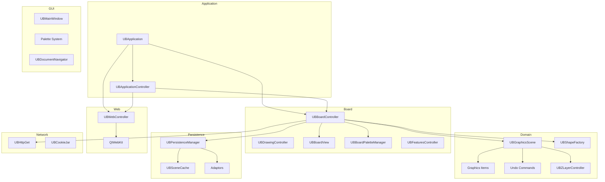
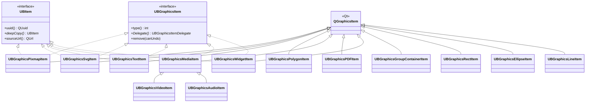

# Structural Diagrams

## Component Diagram - System Modules



## Class Hierarchy - Domain Graphics Items



## Package Dependency Graph

```
┌─────────────────────────────────────────────────────┐
│                    gui (23.6K LOC)                    │
│  Palettes, MainWindow, Thumbnails, Features          │
└────────────┬─────────────────────┬──────────────────┘
             │                     │
             ▼                     ▼
┌─────────────────────┐  ┌─────────────────────┐
│  board (9.8K LOC)   │  │ document (4.7K LOC)  │
│  Controllers, View  │  │ Proxy, Container     │
└────────┬────────────┘  └─────────┬───────────┘
         │                         │
         ▼                         ▼
┌─────────────────────────────────────────────────────┐
│               domain (21.5K LOC)                     │
│  Scene, Items, Shapes, Undo, Handles, Z-Layer        │
└────────────┬────────────────────────────────────────┘
             │
             ▼
┌─────────────────────┐  ┌─────────────────────┐
│  core (10.2K LOC)   │  │ adaptors (11.3K LOC) │
│  App, Persist, Cfg  │  │ SVG, PDF, CFF, Img   │
└────────┬────────────┘  └─────────────────────┘
         │
         ▼
┌─────────────────────────────────────────────────────┐
│            frameworks (4.0K LOC)                      │
│  FileUtils, Geometry, Crypto, Platform, String        │
└─────────────────────────────────────────────────────┘
```
